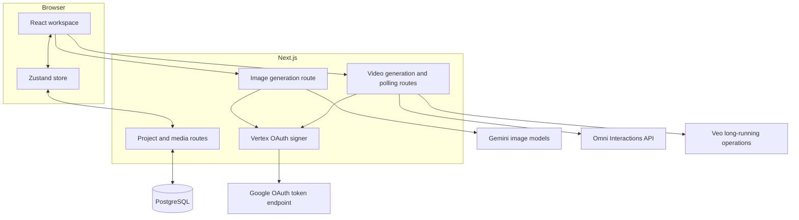

# Architecture

Flow is a Next.js application with a React client, server route handlers, PostgreSQL persistence, and direct server-to-server Vertex AI integration.

## System map

## Browser layer

- `src/app/page.tsx` renders the project dashboard.
- `src/app/project/[id]/page.tsx` coordinates the creative workspace and generation lifecycle.
- `src/components/generation-panel.tsx` owns model-specific controls and reference input.
- `src/components/media-grid.tsx`, `media-tile.tsx`, and `lightbox.tsx` display and manage media.
- `src/lib/store.ts` synchronizes browser state with the internal project/media APIs.

## Server layer

- `src/app/api/projects/**` and `src/app/api/media/**` persist project data.
- `src/app/api/generate/route.ts` sends synchronous Gemini image requests.
- `src/app/api/generate/video/route.ts` starts and polls Omni/Veo generation.
- `src/app/api/generate/video/file/route.ts` proxies completed video bytes or upstream files.
- `src/lib/server/vertex-auth.ts` loads service-account credentials, signs a JWT, exchanges it for OAuth access, and caches the token.
- `src/lib/server/vertex-video.ts` maps UI model IDs and normalizes upstream video response shapes.

## Generation flows

### Images

1. The browser sends a prompt, UI model ID, output controls, and optional base64 references.
2. The route validates input and maps the UI ID to a Vertex model ID.
3. The server signs the OAuth request and calls `generateContent`.
4. The route returns generated data URLs or per-output errors.
5. Successful media is added to PostgreSQL and the project thumbnail is updated.

### Omni video

1. The server creates a background interaction.
2. The browser polls with the returned interaction ID.
3. When complete, Flow normalizes the video result and exposes it through the file proxy.

### Veo video

1. The server starts `predictLongRunning` in the configured video region.
2. The browser polls the returned operation name.
3. Flow calls `fetchPredictOperation` until the operation completes.
4. The file route streams or decodes the result.

Operation and interaction identifiers are validated before they are used in upstream paths.

## Trust boundaries

- Service-account credentials and OAuth tokens remain on the server.
- Public API routes currently have no user authentication or rate limiting.
- Reference images and generated media can be large; hosting limits apply.
- Upstream safety policy and model errors are returned as user-facing failures.

Review [Security](../SECURITY.md) and [Deployment](DEPLOYMENT.md) before exposing Flow publicly.
